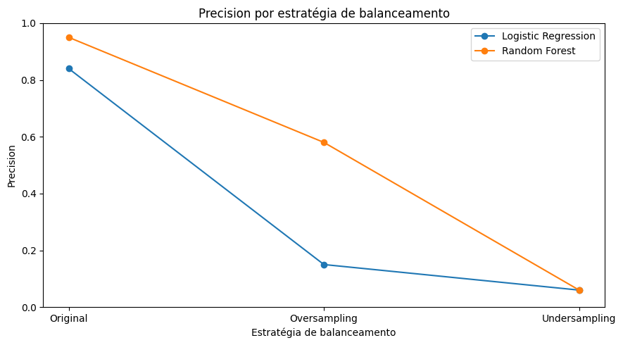
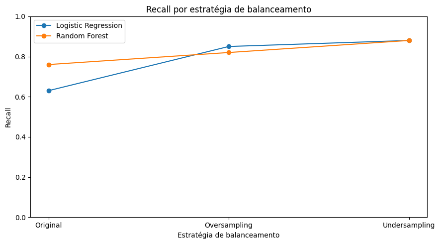
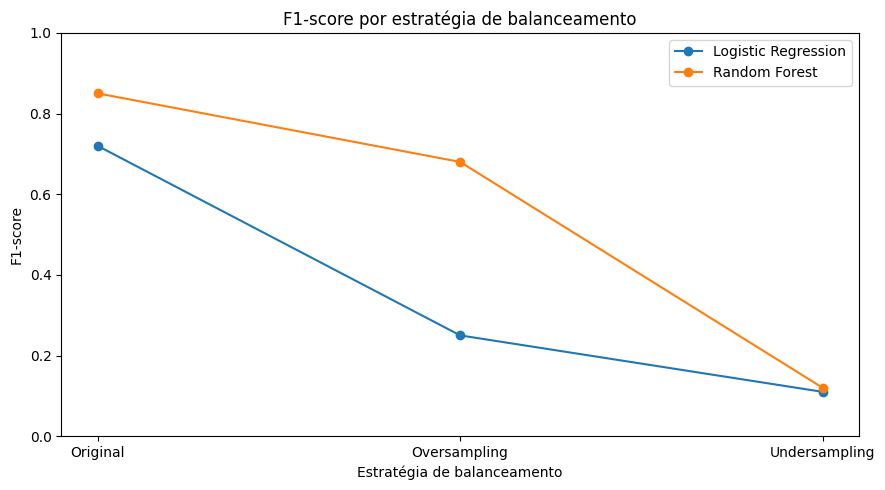
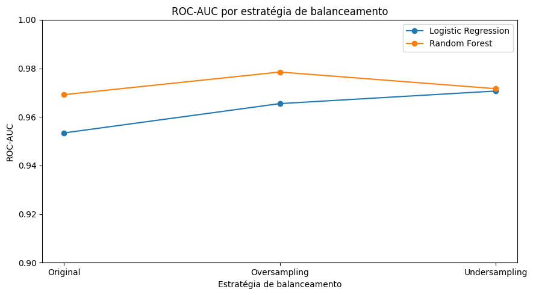

# Projeto de Deteccão de Anomálias nas Transações Financeira
## Introdução:
### Este é o projeto de conclusão do módulo Análise de Dados com Python: da Preparação à Aplicação com Segurança. Nele foi proposto a criação de um modelo simples para a detecção de fraudes bancárias usando como base de dados o modelo opensource creditcar da tensorflow.
### A base de dados é muito boa, não tem tabelas com null, mas ela é desbalanceada na quantidade de fraudes para não fraudes, por isso este projeto é focado em comparar dois modelos em três condições: desbalanceadas, com o balanceamento undersampling e com o balanceamento oversampling.
## Modelos usados:
- ### Logistic Regression:
    - Ele é muito usado para resolver problemas de classificação;
- ### Random Forest:
    - Ele junta várias árvores de decisão para dar a resposta mais certa, neste projeto não foi usado o auto balanceamento, que é onde o modelo adiciona peso nas fraudes por ter menos;
## Metodos de balanceamento usados:
- ### Undersampling:
    - Ele descarta a quantidade a mais de não faudes.
- ### Oversampling:
    - Ele cria ou multiplica a quantidade de dados.
## Gráficos:
- ### Precision dos modelos com a comparação das formas de balanceamento:
    
- ### Recall dos modelos com a comparação das formas de balanceamento:
    
- ### F1-Score dos modelos com a comparação das formas de balanceamento:
    
- ### ROC-AUC dos modelos com a comparação das formas de balanceamento:
    
## Conclusão:
### Este projeto nos ajudou à visualizar de forma analítica que não à um modelo melhor que outro em todos os caso, a famosa bala de prata, já que dependendo do problema a ser solucionado devemos usar diferentes modelos e diferentes formas de balanceamento.
### Observamos que os dois modelos tiveram o melhor Recall no balanceamento ubdersampling mas esta estratégia também gerou o menor precision, tornando os modelos inviáveis de uso, e isso o correu pelo fato da baixa quantidade de dados de treinamento. Já em relação ao balanceamento oversampling tivemos o Recall do Logistic Regression um pouco maior, mas com uma precisão bem menor que a do modelo Random Forest. E por fim nos modelos sem balanceamento tivemos uma boa precisão de hambos, e com um Recall aceitável para o Random Forest enquanto que o do Logistic Regression estava muito próximo do 0.5, mostrando que o modelo estava com uma alta aleatoriedade.
### Por fim o adendo de que este estudo serve apenas como uma comparação entre os modelos e não representa a melhor solução para o problema, pois para isso podemos usar o GridSearchCV para encontrar a melhor combinação de métricas para o modelo além de ser altamente recomendado o uso do modelo Xboost, que é um conjunto de árvores de decição capases de corrigir o erro das árvores anteriores, mas foram escolhidos os modelos Logistic Regression e Random Forest por serem aplamente conhecidos e o modelo Xboost precisar de mais hardware.